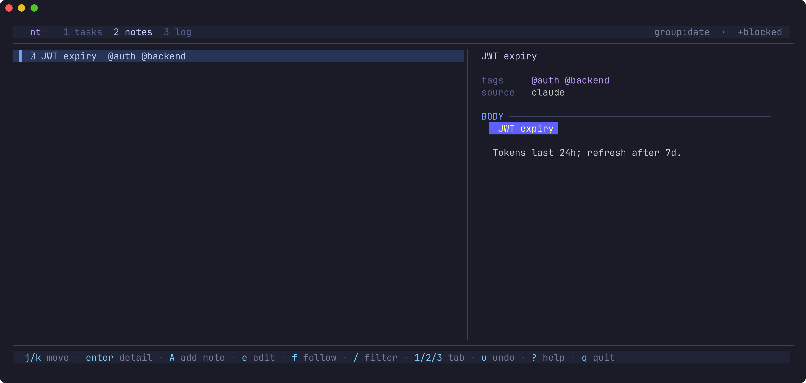
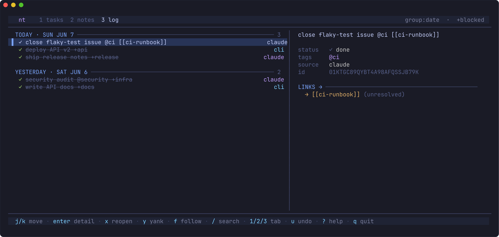
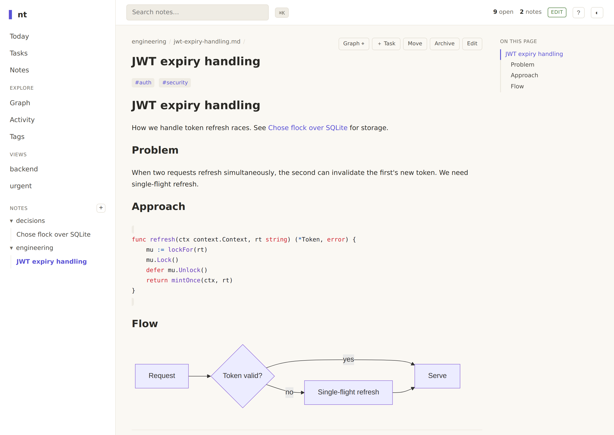
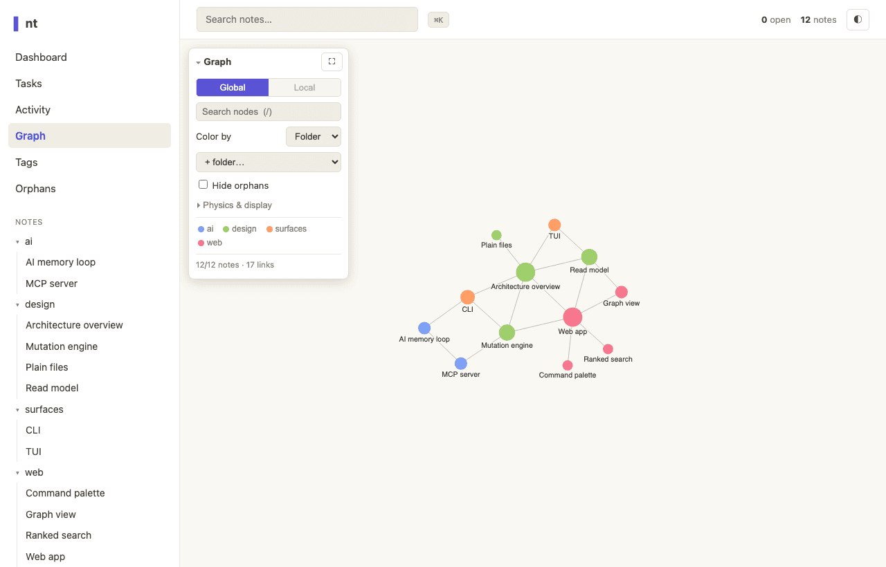

<div align="center">

# nt

### Tasks and notes as plain text — and durable memory your AI agents can't lose.

**Agents forget. Your files don't.** `nt` is a terminal-first task & note manager that keeps everything as plain files — todo.txt tasks and Markdown notes — so your editor, `grep`, `git`, and your AI coding agents all read and write the same source of truth. One static binary. No database. No cloud.

[](https://github.com/navbytes/nt/actions/workflows/ci.yml)
[](https://github.com/navbytes/nt/releases/latest)
[](https://goreportcard.com/report/github.com/navbytes/nt)
[](go.mod)
[](LICENSE)

[Quickstart](#-quickstart) · [Why nt](#-why-youll-like-it) · [AI memory](#-durable-memory-for-your-ai-agents) · [The three faces](#-three-faces-one-store) · [vs. alternatives](#-how-it-compares) · [Docs](SPEC.md)


</div>

---

Most tools make you choose: a slick app that locks your data in a cloud silo, or a pile of text files with no structure. `nt` refuses the trade-off. Your tasks live in `tasks.txt` (the [todo.txt](https://github.com/todotxt/todo.txt) format). Your notes live as `.md` files with YAML frontmatter and `[[wikilinks]]`. On top of those plain files, `nt` gives you a fast CLI, a gorgeous terminal UI, an embedded web app, and a first-class memory loop for AI coding sessions — without ever changing the files underneath. Point Obsidian at the same folder, `grep` it, `git` it, or let Claude read it back next week. It's all just text you own.

## 🚀 Quickstart

```bash
# Install the latest release binary — no Go, no checkout (→ ~/.local/bin)
curl -fsSL https://raw.githubusercontent.com/navbytes/nt/main/install.sh | bash
```

```bash
nt add "fix token refresh race" --pri high --due today --tag auth   # capture a task
nt note "Chose flock over SQLite" --folder decisions                # capture a note
nt                                                                  # open the TUI (just run it)
nt ready                                                            # what should I do next?
nt recall --source claude                                          # read back what an AI captured
nt web                                                              # browse it all in your browser
```

That's it — you're up. `nt help` lists every command; [more install options below](#-install).

## ✨ Why you'll like it

- **📄 It's just files.** todo.txt + Markdown in one folder. Open them in any editor, `grep` them, `git init` them. No lock-in, no proprietary database, nothing to export.
- **🤖 Built for AI memory.** The action items and notes an agent writes today survive as plain text the next agent — or the next *you* — reads back tomorrow. ([see below](#-durable-memory-for-your-ai-agents))
- **🖥️ Three UIs, one store.** A scriptable **CLI**, a live **terminal UI**, and an embedded **web app** — all over the exact same files, always in sync.
- **📦 One static binary.** Pure Go, no CGo, no system dependencies, no runtime. `curl | bash` and go. Works fully offline.
- **🔗 Wikilinks & backlinks.** `[[link]]` any task or note to any other; "linked from" is computed on demand by scanning files — no index to corrupt. Rename a note and every link follows.
- **🧩 Obsidian-compatible.** Notes are plain `.md` + frontmatter, so you can point an Obsidian vault at the `notes/` folder and use it as your GUI while `nt` owns tasks, the CLI/TUI, and the AI loop.
- **⛓️ Real task semantics.** Full A–Z priorities, due dates (with optional time-of-day), start/defer dates, projects, tags, recurrence, sub-tasks and dependencies (`blocks:`/`parent:`) with **cycle detection**, time **estimates + start/stop tracking**, and typed provenance (`discovered-from`).
- **🗓️ A planner, not just a list.** `nt today` / `nt agenda` group your work by date, `nt review` is a weekly triage (overdue · stale · undated · stuck projects), and **daily notes** (`nt journal`) give you a dated log your agents can append to.
- **🔒 Safe by construction.** Every write goes through one locking, atomic, ULID-keyed engine with transactional **undo/redo** — so a concurrent `nt add` from an AI session is never clobbered. Lossless todo.txt round-trip is enforced by test.
- **🌿 Git-native.** `nt git-init` sets up `merge=union` so branches don't conflict on every add; `nt doctor` reconciles after a merge.

## 🧠 Durable memory for your AI agents

> Your AI assistant just created three action items — then the session ended and they vanished. Next session it has no idea what it was doing.

`nt` is the place that memory lives. Because the store is plain text, an agent doesn't need a special database or a running service to remember — it just reads and writes files. Three ways to wire it up:

- **PostToolUse hook** — `nt hook` mirrors Claude Code's `TodoWrite` list into your store automatically (idempotent, tagged `src:claude`). Wire it once in `~/.claude/settings.json`.
- **MCP server** — `nt mcp` exposes typed tools (`nt_ready`, `nt_add`, `nt_recall`, `nt_search`, `nt_note`, `nt_view`, …) over stdio. Register it with one command:
  ```bash
  nt mcp install              # add nt to Claude Code / Claude Desktop (absolute path, idempotent)
  ```
- **The `/nt` skill + recall loop** — teach the agent to capture as it works and `nt recall` prior context when it resumes.

```bash
# During a session (the hook does this for you, or call it directly):
nt add "fix token refresh race" --source claude --tag auth
# A week and three sessions later — read it straight back:
nt recall --source claude --json
```

**Why plain files beat a vector DB for this:** the model reads the *real* note, not an embedding's best guess (reliability); you open only what's relevant (token cost); and you can `git diff` and roll back its memory (auditability). It's the [Karpathy "LLM wiki" pattern](https://venturebeat.com/data/karpathy-shares-llm-knowledge-base-architecture-that-bypasses-rag-with-an), with tasks and a recall loop on top. Full setup & walkthrough → **[docs/claude-integration.md](docs/claude-integration.md)**.

## 🪟 Three faces, one store

### Terminal UI — just run `nt`

A Bubble Tea TUI that adapts to your terminal width (compact strip → standard list → wide split with a live detail pane) and **live-refreshes** via fsnotify when a CLI call or an AI session writes the store. Three tabs — **tasks**, **notes**, and a **Logbook** of completed work grouped by date — with multi-select bulk ops, search-as-you-type, mouse support, undo/**redo**, and a read-only lock. A **`:` command palette** runs any action by name, **vim motions take counts** (`5j`, `12G`), notes capture inline (no `$EDITOR` bounce), and the whole UI follows your terminal's **light/dark** theme. Press `?` for the full keymap.

| Notes | Logbook |
|---|---|
|  |  |

### Web app — `nt web`

A fast single-page app (Svelte + TypeScript) **compiled into the binary** — still one static file, still fully offline, no CDN, no external requests. Browse the folder tree, read Markdown with `[[wikilink]]` navigation, **Mermaid diagrams**, and syntax-highlighted code in light/dark Tokyo Night.

It's built for moving fast: a **⌘K command palette** to jump anywhere, **keyboard go-to chords** (`g t` Today, `g a` Tasks, `g n` Notes… press `?` for the cheat-sheet), **ranked search** with highlighted snippets, a **`/tasks`** planner with an agenda view, a **`/journal`** of daily notes, a clickable **`/graph`** of your links, **`/tags`** and **`/orphans`** browsers, an **activity** feed, an in-note table of contents + backlinks, and a **mobile-friendly** layout you can install as a PWA. Tasks read at a glance — **colour-coded A/B/C priorities**, **relative due dates** (“Today”, “Tomorrow”, “3d ago”), and a quiet badge on the ones your **AI agent** captured — and they act fast too: the quick-add box shows a **live parse preview** of the todo.txt shorthand as you type (`pay rent due:fri !high @home`), `j`/`k` walk the list, `d` **reschedules in one keystroke** (Today / Tomorrow / Next week), and completing or deleting offers a calm **“— Undo” toast** wired to the store’s transactional undo. Your saved **smart views** (`nt view save`) appear in the sidebar and recall the exact same query the CLI runs. Pass `--edit` for a real **CodeMirror editor** — markdown highlighting, `[[`-wikilink and `/`-slash-command autocomplete, live preview, and backlinks while you write — to create and edit notes *and* tasks right in the browser (saves are guarded by a per-process CSRF token and an `If-Match` check so nothing gets clobbered). Binds `127.0.0.1` only and **read-only by default** — your notes are never on the network.

<div align="center">
<picture>
  <source media="(prefers-color-scheme: dark)" srcset="docs/screenshots/web-dark.png">
  <source media="(prefers-color-scheme: light)" srcset="docs/screenshots/web-light.png">
  
</picture>
</div>

<div align="center">
<picture>
  <source media="(prefers-color-scheme: dark)" srcset="docs/screenshots/web-graph-dark.png">
  <source media="(prefers-color-scheme: light)" srcset="docs/screenshots/web-graph-light.png">
  
</picture>
<br><em>The <code>/graph</code> view — your notes and links as a constellation.</em>
</div>

### CLI — scriptable everything

```bash
nt add "write migration" --blocks task:5 --project api   # task:5 hides until this is done
nt ready --json                                          # open, unblocked work by urgency (agent entry point)
nt agenda --days 7                                       # Overdue / Today / Upcoming, grouped
nt add "weekly review" --due monday --recur weekly       # completing spawns the next occurrence
nt search "auth" --tag backend                           # ripgrep + title match, tag-filtered
nt links jwt-expiry                                      # forward links + backlinks for a note
nt log --since 2026-01-01 --json                         # the Logbook, machine-readable
```

<details>
<summary><b>Full command cheatsheet</b></summary>

```bash
nt add "title" --pri high --due "fri 5pm" --est 2h --tag t --project p   # capture a task (a = alias)
nt note "title" --folder work --field status=stable         # capture a note (folders + frontmatter)
nt journal                  # open today's daily note (j = alias)
nt                          # TUI            nt list [--status|--tag|--sort urgency|--tree|--all|--json]
nt view <name>              # saved views    nt view save <name> [list flags]   nt view list / rm <name>
nt ready / today / agenda   # what's next    nt done <id|task:N>     nt update <id> --status doing
nt review [--stale N]       # weekly triage  nt start <id> … nt stop <id>   (time tracking → spent:)
nt search <q> [--tag…]      # find           nt tags                 nt tag <note…> +ref -inbox
nt links <id> [--orphans]   # graph          nt recall [--source] [--json]   nt log [--since|--days N]
nt skip <id>                # recurring: next occurrence      nt mv <note> <dest>   (rewrites [[links]])
nt edit <id|task:N>         # safe $EDITOR round-trip        nt rm <note> [--force]   (→ .trash/)
nt web [--edit] [--port N]  # browser app (--detach to run in the background; --status / --stop)
nt undo / "redo"   nt mcp [install]   nt hook
nt git-init && nt doctor    # version-control the store + reconcile merges (+ dependency checks)
nt path                     # print $NT_DIR  nt archive   nt --version   nt help
# Optional defaults live in $NT_DIR/config.toml ([defaults]/[web]/[tui]).
```
</details>

## 🆚 How it compares

|  | **nt** | todo.txt CLIs | Taskwarrior | Obsidian | mem0 / MCP memory |
|---|:---:|:---:|:---:|:---:|:---:|
| Storage you own (plain files) | ✅ `.txt`+`.md` | ✅ `.txt` | ➖ own DB | ✅ `.md` | ❌ vector DB |
| Tasks **and** notes, unified | ✅ | tasks only | tasks only | notes only | — |
| Agent-readable with no service | ✅ (or MCP if you want) | ✅ | ➖ | ➖ plugin | ❌ needs the service |
| Single static binary, no cloud | ✅ | varies | ✅ | ❌ app | ❌ service |
| Works with `grep`/`git`/editor | ✅ | ✅ | ➖ | ✅ | ❌ |
| CLI **+** TUI **+** web in one | ✅ | ❌ | ➖ | GUI | ❌ |
| Built for AI session memory | ✅ | ❌ | ❌ | ➖ | ✅ |

Honest take: if you want a polished cloud app with shared boards and assignees, use Notion or Linear. `nt` is for people who want their data as text they control.

## 🗂️ How your stuff is stored

One global store at `$NT_DIR` (default `~/.local/share/nt`):

```
~/.local/share/nt/
├── tasks.txt     # todo.txt format, one line per task
├── done.txt      # archived completed tasks
├── undo.jsonl    # undo transaction journal
└── notes/*.md    # Markdown notes with YAML frontmatter
```

A task line is just todo.txt with a few conventions:

```
(A) fix auth bug +api @backend due:2026-06-05 [[jwt-expiry]] src:claude id:01JZ8RT3
```

`(A)`–`(Z)` priority · `+project` · `@tag` · `due:` (optionally `…T17:00`) · `t:` start/defer · `rec:` recurrence · `est:`/`spent:` time · `src:` origin · `id:` ULID · `[[target]]` links to any note or task · `parent:`/`blocks:` are typed task links. Unknown `key:value` tokens from other todo.txt tools are preserved byte-for-byte.

<details>
<summary><b>Notes ↔ Obsidian (use Obsidian as the GUI, nt as the brain)</b></summary>

`nt` has no notes GUI of its own — and doesn't need one. Notes are plain `.md` + YAML frontmatter + `[[wikilinks]]`, so you can **point an Obsidian vault at the `notes/` folder** and use Obsidian as the GUI while `nt` owns tasks, the CLI/TUI, and the AI-memory loop. `nt` reads back what Obsidian writes: nested subfolders, block-list `tags:`/`aliases:`, notes without an H1 (title falls back to the filename), and link variants (`[[folder/note]]`, `[[note#heading]]`, `[[note|alias]]`) resolved by shortest path-suffix — a bare name colliding across folders is flagged ambiguous rather than guessed.

Rename/move is **nt-native**: `nt mv <note> <new>` (or `r` in the TUI) renames the file and rewrites every `[[link]]` to it across tasks and notes, so links never dangle. It deliberately does **not** route agents through Obsidian's REST-API MCP (slow, token-heavy, whole-vault exposure) — Obsidian stays an optional human GUI, never a dependency in the agent's path.
</details>

## 🛡️ What's guaranteed (the hard parts)

- **Lossless round-trip** — an unmodified `tasks.txt` line is re-emitted byte-for-byte, preserving unknown tokens from other todo.txt tools (enforced by test).
- **No lost updates** — every write locks, re-reads, mutates, and atomically renames through one ULID-keyed engine, so a concurrent AI-session write is never clobbered (concurrency test included).
- **Transactional undo/redo** — each change journals before-images keyed by ULID; `nt undo` reverses them and `nt`'s redo re-applies them.
- **Dependency integrity** — `nt doctor` detects dependency **cycles** (so a `blocks:` deadlock never silently hides tasks) and stale/dangling links, and reconciles duplicate ids after a git merge.

## 🙅 When nt is *not* for you

- You want a managed cloud app with shared boards, assignees, and dashboards → Notion / Linear / Things.
- You never touch a terminal and want zero file management → a GUI-first app will feel better.
- You need a native mobile app from an app store → `nt web` is an installable PWA, but it's not a packaged native app.

## 📦 Install

```bash
# Curl — latest release binary to ~/.local/bin (no Go needed)
curl -fsSL https://raw.githubusercontent.com/navbytes/nt/main/install.sh | bash

# Go — install the latest tagged release
go install github.com/navbytes/nt@latest

# From source
git clone https://github.com/navbytes/nt && cd nt && make install
```

Single static binary for Linux & macOS (amd64/arm64). Releases are automated by GoReleaser on a `vX.Y.Z` tag ([RELEASING.md](RELEASING.md)). Homebrew is planned (`brew install navbytes/tap/nt`).

**Desktop app** — each release also attaches native **`nt-desktop`** bundles (macOS / Linux / Windows): the same web UI in a native window over your local store, editing included, with **no port opened at all** (the webview talks to the Go server in-process). See [desktop/README.md](desktop/README.md).

<details>
<summary><b>Build from source / develop</b></summary>

```bash
go build -o nt .       # Go 1.25+
./nt                   # launch the TUI
make test              # run the Go test suite
make web-build         # rebuild the embedded web app (needs Node 22+)
vhs docs/demo.tape     # (optional) render an animated demo → docs/demo.gif
```
The web app's built bundle is committed and embedded with `//go:embed`, so `go build` / `go install` need no Node toolchain. See **[SPEC.md](SPEC.md)** for the full design.
</details>

## 🤝 Contributing

Issues and PRs welcome. `go test ./...` must pass; run `make test`. The architecture and design rationale live in **[SPEC.md](SPEC.md)**; AI-integration details in **[docs/](docs/)**.

## License

[MIT](LICENSE) © navbytes
