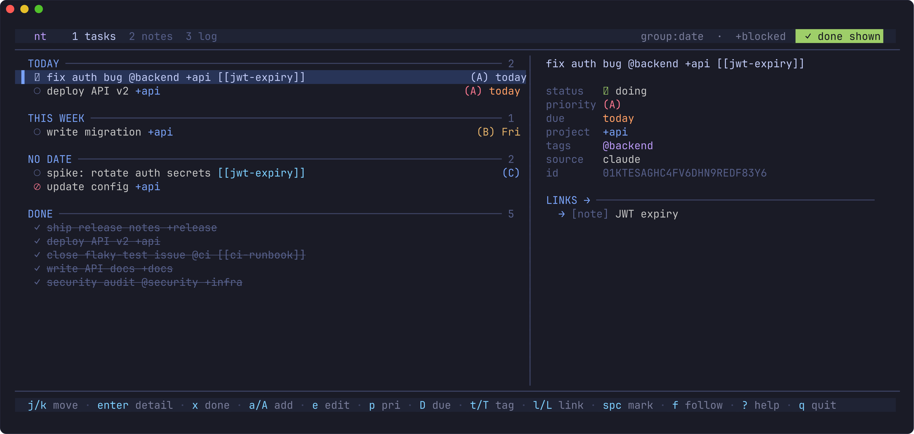
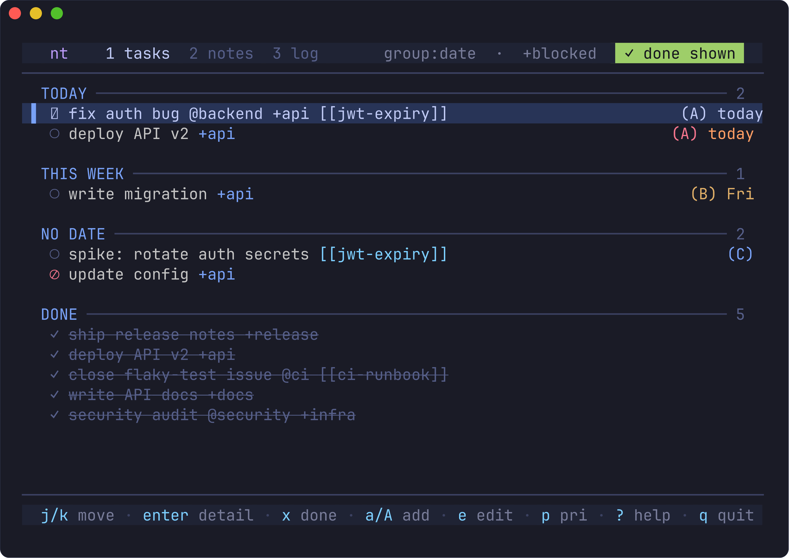
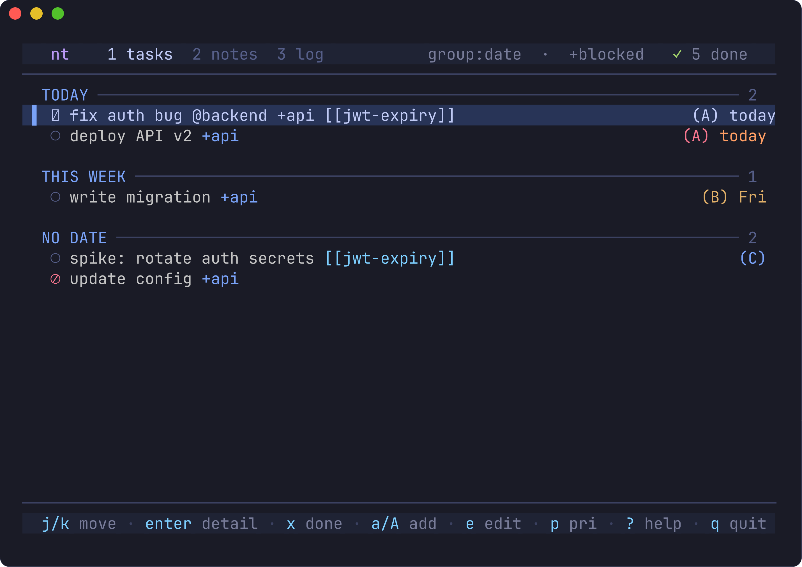
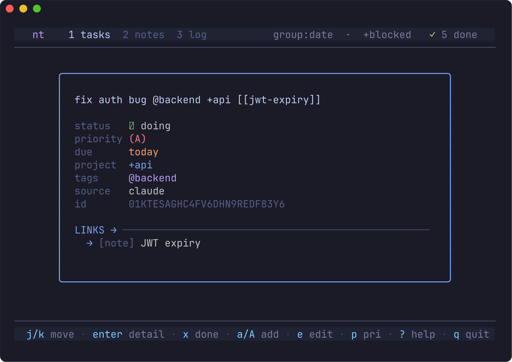
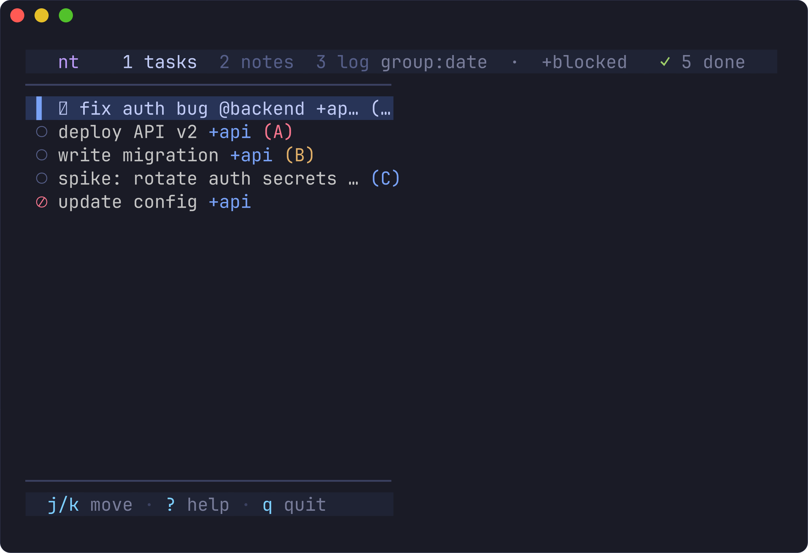
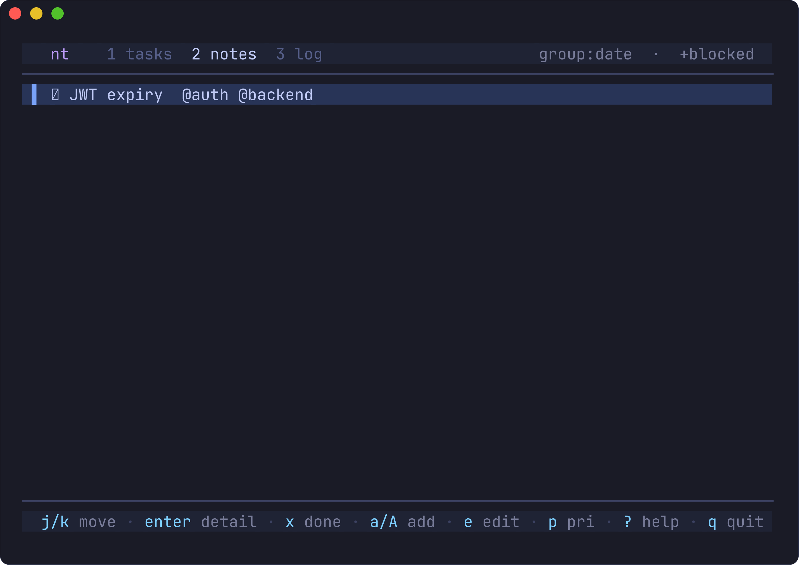
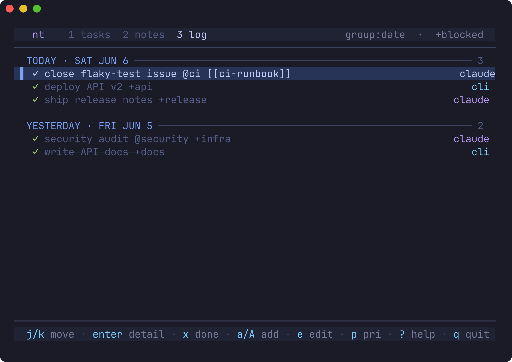

# nt — screenshots

Real `View()` output captured from the render harness and frozen to PNG with
[charmbracelet/freeze](https://github.com/charmbracelet/freeze).

Regenerate after a UI change:

```sh
./scripts/screenshots.sh
```

| | View |
|---|---|
| **Tasks — wide split** |  |
| **Tasks — standard** |  |
| **Tasks — done hidden (`✓ N done` chip)** |  |
| **Detail overlay** |  |
| **Compact strip** |  |
| **Notes** |  |
| **Notes — wide split** |  |
| **Logbook — wide split** |  |
| **Logbook — standard** |  |
